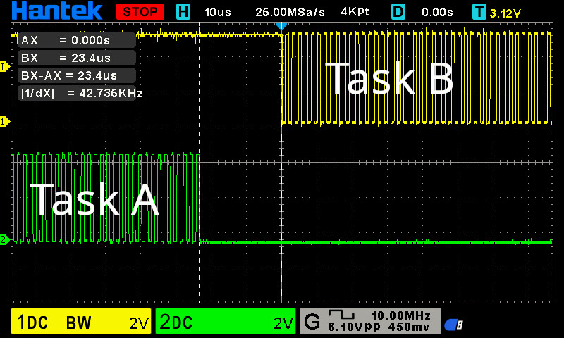

# atmega328-scheduler v0.4.0

Simple preemptive scheduler for atmega328p

## Features

- Preemptive scheduler
- Custom built test suite with simavr
- Mutex with priority inheritance
- Message que with support for multiple producers & consumers
- gpio driver
- timer0 driver

## Project layout

```bash
atmega328-scheduler/
  |- docs/          -- Doxygen docs
  |- examples/      -- Example projects
  |- lib/           -- External libraries
  |- include/kernel -- Public header files
  |- src/           -- Core scheduler code
  |- submodules/
      |- cmake-avr/ -- Avr cmake toolchain
      |- simavr/    -- Avr simulator source code
  |- test/
      |- avr/                 -- Avr test files
      |- native_test_runners/ -- Avr test file runners
```

## Building the project

### Setting up development environment

Needed packages:
* avr-gcc
* avr-libc (<= 2.2.0)*
* gcc
* cmake
* make
* pkg-config
* libelf (simavr)
* libdwarf (simavr)

´*´ simavr doesn't compile with avr-libc 2.3.0 or higher

#### Installing packages

Ubuntu/debian:

```bash
sudo apt-get install git gcc-avr avr-libc gcc g++ cmake make libelf-dev libdwarf-dev pkg-config
```

Arch linux:

```bash
sudo pacman -S --needed git avr-gcc avr-libc gcc cmake make libelf libdwarf base-devel
```

#### Building the project

Clone the repository and cd in to the repo

```bash
git clone https://github.com/Mikxus/atmega328-scheduler.git --recurse-submodules; cd atmega328-scheduler
```

Symlink AVR's header files to simavr since it doesn't come with them.

Arch linux:

```bash
ln -s /usr/avr/include/avr/ submodules/simavr/simavr/cores/avr
```

Ubuntu/debian:

```bash
ln -s /usr/lib/avr/include/avr/ submodules/simavr/simavr/cores/avr
```

Generate out of source build system with cmake

```bash
cmake -Bbuild/release --config Release
# Or debug build
cmake -Bbuild/debug --config Debug
```

To build the project as release or debug:

```bash
cmake --build build/release --config Release
 
cmake --build build/debug --config Debug
```

### Running tests

Build the project

```bash
cmake --build build/debug --config CMAKE_BUILD_TYPE=Debug
```

Export LD_LIBRARY_PATH to find simavr's shared library

**Note**: change the path if you are not on x86_64-pc-linux-gnu

```bash
export LD_LIBRARY_PATH=/lib:$(pwd)/submodules/simavr/simavr/obj-x86_64-pc-linux-gnu/
```

Now you can run the tests with:

```bash
ctest --test-dir build/debug --rerun-failed --output-on-failure
```

### Doxygen documentation
To build docs run the following command:
```bash
cmake --build build/debug|release --target docs
```
Doxygen generates html and latex docs in docs folder.

## License
This library is under the [MIT license](https://github.com/Mikxus/atmega328-scheduler/blob/main/LICENSE) except the test folder. The code under test folder is licensed under [GPL v3.0](https://github.com/Mikxus/atmega328-scheduler/blob/main/test/LICENSE) since it uses simavr's source code.
